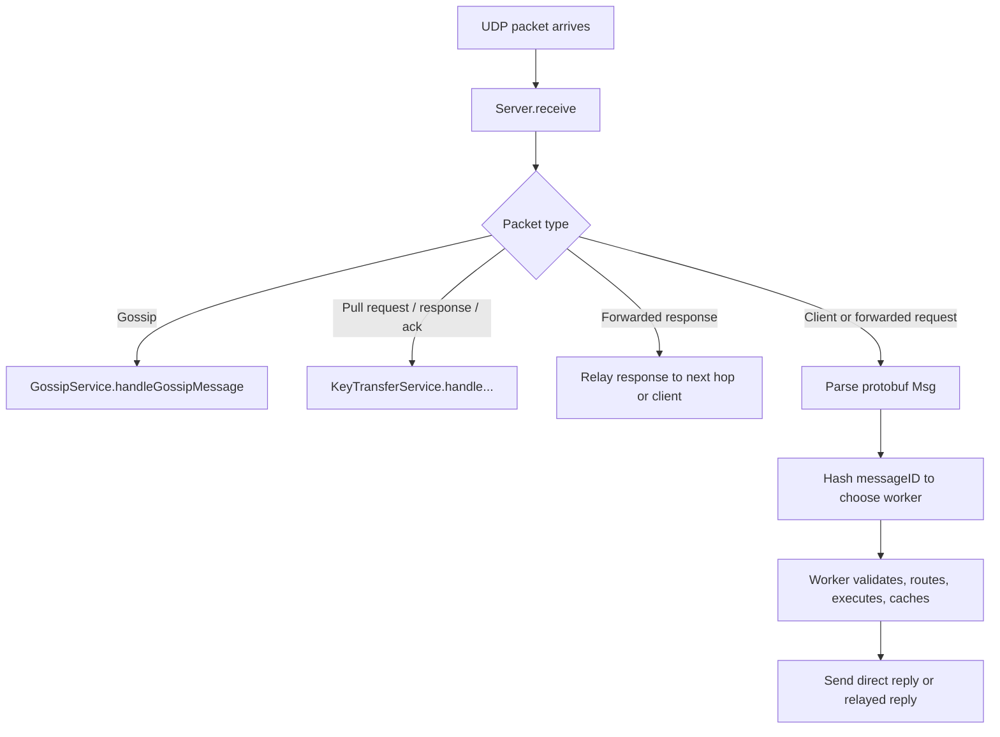
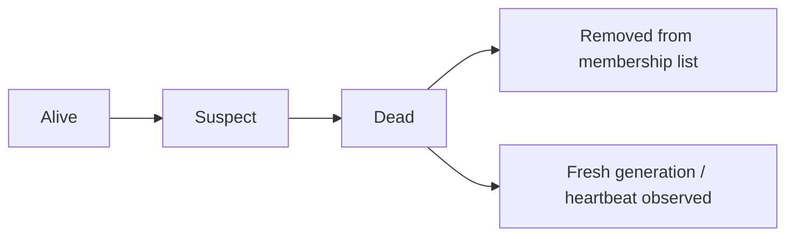
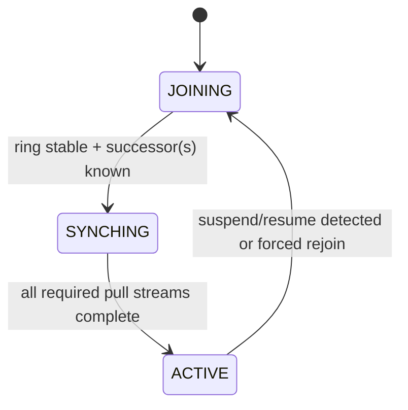

# G20 - Distributed Systems Assignment 9

**Group ID:** G20  
**Verification Code:** 5409645920

---

## Deployment Commands

Assignment 9 deploys **80 nodes** with netem parameters (5ms delay, 0.25% loss) and uses a `--seed` flag for cluster bootstrapping.

### Server EC2 Instance

```bash
#!/usr/bin/env bash
set -euo pipefail

JAR="A9-1.0-SNAPSHOT-jar-with-dependencies.jar"
SERVER_PRIVATE_IP="172.31.44.173"
START_PORT=43100
END_PORT=43179
MEM_PER_SERVER="512m"
NODE_FILE="nodes_server.txt"
NODE_COUNT=$(( END_PORT - START_PORT + 1 ))   # 80

# Auto-detect main network interface
IFACE=$(ip route get 8.8.8.8 | awk '{for(i=1;i<=NF;i++) if($i=="dev") print $(i+1)}' | head -1)
echo "Detected interface: $IFACE"

echo "=== Stopping old A9 servers ==="
pkill -f "$JAR" 2>/dev/null || true
sleep 2
pkill -9 -f "$JAR" 2>/dev/null || true
sleep 3

echo "=== Checking ports are free ==="
BUSY=0
for PORT in $(seq $START_PORT $END_PORT); do
    if ss -lunp | grep -q ":${PORT} "; then
        echo "  WARNING: port $PORT still in use!"
        BUSY=1
    fi
done
if [ "$BUSY" -eq 1 ]; then
    echo "Waiting extra 5s for ports to release..."
    sleep 5
fi
echo "Ports check done."

echo "=== Clearing old netem rules ==="
sudo tc qdisc del dev lo      root 2>/dev/null || true
sudo tc qdisc del dev "$IFACE" root 2>/dev/null || true

echo "=== Applying netem (A9: 5ms delay, 0.25% loss) ==="
sudo tc qdisc add dev lo      root netem delay 5ms loss 0.25%
sudo tc qdisc add dev "$IFACE" root netem delay 5ms loss 0.25%
echo "netem applied to lo and $IFACE"

echo "=== Verifying netem ==="
tc qdisc show dev lo
tc qdisc show dev "$IFACE"

echo "=== Rebuilding $NODE_FILE ($NODE_COUNT nodes) ==="
> "$NODE_FILE"
for PORT in $(seq $START_PORT $END_PORT); do
    echo "${SERVER_PRIVATE_IP}:${PORT}" >> "$NODE_FILE"
done
echo "Node file written."

echo "=== Starting $NODE_COUNT A9 servers (each -Xmx${MEM_PER_SERVER}) ==="

# --- Seed node first ---
echo "  Starting SEED node on port $START_PORT..."
nohup java -Xmx"$MEM_PER_SERVER" -jar "$JAR" "$START_PORT" "$NODE_FILE" --seed \
    > "server_${START_PORT}.log" 2>&1 &
sleep 2   # let seed initialize before remaining nodes join

# --- Remaining nodes ---
for PORT in $(seq $((START_PORT + 1)) $END_PORT); do
    nohup java -Xmx"$MEM_PER_SERVER" -jar "$JAR" "$PORT" "$NODE_FILE" \
        > "server_${PORT}.log" 2>&1 &
    IDX=$(( PORT - START_PORT ))
    if (( IDX % 10 == 0 )); then
        sleep 1
    fi
done

echo "Waiting 20s for startup + gossip convergence..."
sleep 20

echo
echo "=== Health check: processes ==="
TOTAL=$(ps aux | grep "$JAR" | grep -v grep | wc -l)
echo "Running processes: $TOTAL / $NODE_COUNT"
DEAD=0
for PORT in $(seq $START_PORT $END_PORT); do
    if ! ps aux | grep -q "[j]ava.*${PORT}.*nodes_server"; then
        echo "  DEAD: port $PORT"
        echo "    Log tail: $(tail -1 "server_${PORT}.log" 2>/dev/null || echo 'no log')"
        DEAD=$((DEAD + 1))
    fi
done
if [ "$DEAD" -gt 0 ]; then
    echo "WARNING: $DEAD node(s) not running! Check logs above."
else
    echo "All $NODE_COUNT nodes running."
fi

echo
echo "=== Health check: ports listening ==="
NOT_LISTENING=0
for PORT in $(seq $START_PORT $END_PORT); do
    if ! ss -lunp | grep -q ":${PORT} "; then
        echo "  NOT LISTENING: $PORT"
        NOT_LISTENING=$((NOT_LISTENING + 1))
    fi
done
if [ "$NOT_LISTENING" -eq 0 ]; then
    echo "All $NODE_COUNT ports listening."
else
    echo "WARNING: $NOT_LISTENING port(s) not listening!"
fi

echo
echo "=== Ping sanity check (expect ~10ms RTT on localhost) ==="
ping -c 3 127.0.0.1 | tail -2

echo
echo "=== Done ==="
```

### Client EC2 Instance

```bash
#!/usr/bin/env bash
set -euo pipefail

LOCAL_JAR="A9-1.0-SNAPSHOT-jar-with-dependencies.jar"
EVAL_JAR="a9_2026_eval_tests_v2.jar"
SERVER_PUBLIC_IP="98.86.242.181"
START_PORT=43100
END_PORT=43179
SECRET_CODE="5409645920"
NODE_FILE="nodes_server.txt"

echo "Stopping old local standalone A9 server..."
pkill -f "$LOCAL_JAR" 2>/dev/null || true
sleep 2

# --- Standalone node (collocated with eval client) ---
# Spec: 127.0.0.1:43100, -Xmx64m, --seed (only node in its deployment)
echo "Starting standalone localhost server for local check..."
echo "127.0.0.1:43100" > nodes_standalone.txt
nohup java -Xmx64m -jar "$LOCAL_JAR" 43100 nodes_standalone.txt --seed > standalone_server.log 2>&1 &
sleep 5

echo
echo "Local standalone process check:"
ps aux | grep "$LOCAL_JAR" | grep -v grep || true

# --- Build node file pointing to the 80-node remote deployment (public IPs) ---
echo
echo "Rebuilding $NODE_FILE for submit..."
> "$NODE_FILE"
for PORT in $(seq $START_PORT $END_PORT); do
    echo "${SERVER_PUBLIC_IP}:${PORT}" >> "$NODE_FILE"
done

echo
echo "First 5 lines of $NODE_FILE:"
head -n 5 "$NODE_FILE"

echo
echo "Running evaluator submit..."
java -Xmx12g -jar "$EVAL_JAR" \
    --submit \
    --servers-list "$NODE_FILE" \
    --secret-code "$SECRET_CODE"
```

---

## Architecture Overview

### Repository / Package Structure

```text
A9/
├── src/main/java/ca/NetSysLab/ProtocolBuffers/
│   ├── Message.java
│   ├── KeyValueRequest.java
│   └── KeyValueResponse.java        # generated protobuf message classes
├── src/main/java/com/g20/CPEN431/A9/
│   ├── Main.java                    # entrypoint: parses nodes file, initializes server
│   ├── Constants.java               # global tuning constants and protocol limits
│   ├── server/
│   │   ├── Server.java              # UDP receive loop and packet-type dispatch
│   │   ├── Worker.java              # request execution / forwarding / overload handling
│   │   └── RequestHandler.java      # PUT/GET/REMOVE/admin command handlers
│   ├── network/
│   │   ├── Node.java                # node identity on the cluster
│   │   ├── NodeStatus.java          # alive/suspect/dead membership state
│   │   ├── GossipMessage.java       # gossip wire format helpers
│   │   ├── GossipService.java       # membership, failure detection, ring stabilization
│   │   └── KeyTransferService.java  # join/rejoin recovery and pull-based key transfer
│   ├── storage/
│   │   ├── KeyValueStore.java       # memory-bounded in-memory key/value store
│   │   └── ConsistentHashmap.java   # ownership ring and successor lookup
│   ├── cache/
│   │   ├── ResponseCache.java
│   │   ├── ConcurrentResponseCache.java
│   │   ├── DualResponseCache.java   # duplicate-response cache with rotating windows
│   │   └── CachedResponse.java
│   └── util/
│       ├── MessageUtils.java        # checksum, forward/relay helpers, response builders
│       └── MemoryUtils.java
└── src/main/proto/
    ├── Message.proto
    ├── KeyValueRequest.proto
    └── KeyValueResponse.proto       # protobuf schemas
```

### Runtime Boot Sequence

1. `Main` parses the nodes file, computes node IDs by line order, initializes constants, and sets the key-value store memory cap.
2. `Server` binds the UDP socket, finds the local node entry, and constructs the consistent hash ring.
3. `GossipService` starts membership dissemination/failure detection.
4. `KeyTransferService` starts recovery logic; seed nodes immediately enter `ACTIVE`.
5. Worker threads start, and the main UDP loop dispatches gossip, recovery, forwarded, and client packets.

### Request Lifecycle



### Consistent Hash Ring
A **consistent hash ring** was implemented to handle mapping nodes to a ring-space. The implementation uses:

| Component | Implementation | Rationale |
|-----------|---------------|-----------|
| Underlying Structure | `TreeMap` | Provides O(log n) lookup for successor nodes |
| Concurrency Control | `ReentrantReadWriteLock` | Optimized for read-heavy workloads; allows concurrent reads while ensuring write correctness |

> **Design Decision:** Since read operations are expected to be significantly more frequent than writes, the read-write lock pattern was chosen to maximize throughput while maintaining thread safety.

### Inter-Node Communication
**Gossip-style service** is used for peer-to-peer communication between nodes, enabling decentralized failure detection and state propagation.

### Membership and Failure Detection

Membership is maintained through push-pull gossip. Bootstrap peers are inserted into the membership table so that they can be contacted, but they are **not** placed on the hash ring until gossip confirms they are alive. This avoids routing requests to dead nodes during startup or rejoin.

The ring is considered stable only after several gossip cycles with a stable observed membership size. This warmup reduces churn immediately after startup, and lets recovery wait for a reasonably converged view of the cluster before pulling keys.

Failure detection is staged:



- **Alive**: node is responding to gossip or has fresh heartbeat information.
- **Suspect**: node missed the failure timeout; it remains on the ring temporarily while waiting for refutation.
- **Dead**: node failed to refute suspicion in time and is removed from the ring.
- **Cleanup**: dead node is eventually removed from the membership table.
- **Rejoined**: a node with a newer generation is re-added and treated as a fresh incarnation.

Additionally, suspend/resume events (e.g. `SIGSTOP` / `SIGCONT`) are detected through a wall-clock time jump. When this happens, the node bumps its generation and re-enters recovery so peers treat it as a new incarnation rather than a stale survivor.

### Recovery / Rejoin State Machine

Key transfer is **pull-based**. A recovering node retrieves keys from its successor(s), because active successors are treated as the authoritative temporary holders for those key ranges.



- **JOINING**: node has started, but waits for ring stabilization and suitable successors.
- **SYNCHING**: node issues pull requests, receives key batches, ACKs them, and tracks completion per successor.
- **ACTIVE**: node serves normal traffic and can act as a recovery source for predecessors.

Local writes performed while recovering take precedence over transferred data. The storage layer supports this by exposing a `putIfAbsentRawBytes()` path for recovery traffic, ensuring transferred state does not overwrite newer local writes.

### Storage and Memory Model

| Topic | Implementation |
|-------|----------------|
| Store type | `ConcurrentHashMap<ByteString, byte[]>` |
| Value format | `4-byte version` + raw value bytes |
| Memory limit | Store capacity is derived from JVM max memory minus a reserved system/process budget |
| Admission check | `canAddEntry()` estimates entry footprint before inserts |
| Recovery support | Raw byte scans and `putIfAbsentRawBytes()` support pull-based synchronization |

### Core Invariants

- Only **ACTIVE** nodes are authoritative recovery sources for pulling key ownership during rejoin.
- Known bootstrap peers may exist in membership before they are eligible to appear on the hash ring.
- Ring stability is delayed until gossip warmup converges, reducing early routing churn.
- A shutdown command exits immediately with no cleanup, as required by the assignment spec.
- Local writes during recovery override transferred data from other nodes.

---

## Shutdown Behavior Verification

**Proof of immediate crash/termination upon receiving shutdown request:**

| Attribute | Value |
|-----------|-------|
| **File** | `RequestHandler.java` |
| **Line** | 107 (context: lines 105-109) |


── Cluster status ──
Node file:  nodes_server.txt

To test (dry-run, local):
  java -Xmx4g -jar a9_2026_eval_tests_v2.jar --servers-list=nodes_server.txt --secret-code=5409645920

To run only performance:
  java -Xmx4g -jar a9_2026_eval_tests_v2.jar --servers-list=nodes_server.txt --secret-code=5409645920 --only-performance 512

To run only suspend/rejoin:
  java -Xmx4g -jar a9_2026_eval_tests_v2.jar --servers-list=nodes_server.txt --secret-code=5409645920 --only-suspend-rejoin

To stop:
  pkill -f 'A9-1.0-SNAPSHOT'
